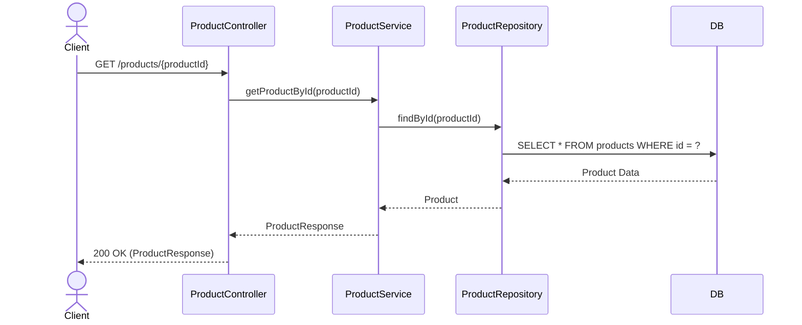

```mermaid
sequenceDiagram
    actor Client
    participant CartController
    participant CartService
    participant ProductService
    participant CartRepository
    participant ProductRepository
    participant DB

    Client->>CartController: POST /cart/items<br/>{userId, productId, quantity}
    CartController->>CartService: addCartItem(userId, productId, quantity)
    
    CartService->>ProductService: getProductById(productId)
    ProductService->>ProductRepository: findById(productId)
    ProductRepository->>DB: SELECT * FROM products WHERE id = ?
    DB-->>ProductRepository: Product Data
    ProductRepository-->>ProductService: Product
    ProductService-->>CartService: Product
    
    alt 상품 존재
        CartService->>CartService: 재고 확인
        alt 재고 충분
            CartService->>CartRepository: save(cartItem)
            CartRepository->>DB: INSERT INTO cart_items
            DB-->>CartRepository: Success
            CartRepository-->>CartService: CartItem
            CartService-->>CartController: CartItemResponse
            CartController-->>Client: 201 Created
        else 재고 부족
            CartService-->>CartController: InsufficientStockException
            CartController-->>Client: 400 Bad Request (재고 부족)
        end
    else 상품 없음
        ProductService-->>CartService: ProductNotFoundException
        CartService-->>CartController: ProductNotFoundException
        CartController-->>Client: 404 Not Found
    end
```

```mermaid
sequenceDiagram
    actor Client
    participant CartController
    participant CartService
    participant CartRepository
    participant DB

    Client->>CartController: DELETE /cart/items/{cartItemId}
    CartController->>CartService: removeCartItem(userId, cartItemId)
    
    CartService->>CartRepository: findById(cartItemId)
    CartRepository->>DB: SELECT * FROM cart_items WHERE id = ?
    DB-->>CartRepository: CartItem
    CartRepository-->>CartService: CartItem
    
    alt 장바구니 항목 존재
        CartService->>CartService: 소유자 확인 (userId)
        alt 소유자 일치
            CartService->>CartRepository: delete(cartItemId)
            CartRepository->>DB: DELETE FROM cart_items WHERE id = ?
            DB-->>CartRepository: Success
            CartRepository-->>CartService: Success
            CartService-->>CartController: Success
            CartController-->>Client: 204 No Content
        else 소유자 불일치
            CartService-->>CartController: UnauthorizedException
            CartController-->>Client: 403 Forbidden
        end
    else 장바구니 항목 없음
        CartService-->>CartController: CartItemNotFoundException
        CartController-->>Client: 404 Not Found
    end
```

```mermaid
sequenceDiagram
    actor Client
    participant OrderController
    participant OrderFacade
    participant OrderService
    participant CartService
    participant CouponService
    participant ProductService
    participant OrderRepository
    participant CouponRepository
    participant ProductRepository
    participant CartRepository
    participant DB

    Client->>OrderController: POST /orders<br/>{userId, orderType, couponId?}
    OrderController->>OrderFacade: createOrder(userId, orderType, couponId)
    
    alt 장바구니 주문
        OrderFacade->>CartService: getCartItems(userId)
        CartService->>CartRepository: findByUserId(userId)
        CartRepository->>DB: SELECT * FROM cart_items WHERE user_id = ?
        DB-->>CartRepository: Cart Items
        CartRepository-->>CartService: List<CartItem>
        CartService-->>OrderFacade: List<CartItem>
    end
    
    OrderFacade->>OrderFacade: 총 금액 계산 (totalAmount)
    
    opt 쿠폰 사용
        OrderFacade->>CouponService: validateCoupon(couponId, userId)
        CouponService->>CouponRepository: findById(couponId)
        CouponRepository->>DB: SELECT * FROM user_coupons WHERE id = ?
        DB-->>CouponRepository: UserCoupon
        CouponRepository-->>CouponService: UserCoupon
        
        CouponService->>CouponService: 유효성 검증<br/>(소유자, 사용여부, 유효기간)
        alt 쿠폰 유효
            CouponService-->>OrderFacade: discountAmount
            OrderFacade->>OrderFacade: finalAmount = totalAmount - discountAmount
        else 쿠폰 무효
            CouponService-->>OrderFacade: InvalidCouponException
            OrderFacade-->>OrderController: InvalidCouponException
            OrderController-->>Client: 400 Bad Request (쿠폰 무효)
        end
    end
    
    OrderFacade->>OrderService: createPendingOrder(userId, items, totalAmount, discountAmount, finalAmount)
    OrderService->>OrderService: 주문 생성 (상태: PENDING)
    OrderService->>OrderRepository: save(order)
    OrderRepository->>DB: INSERT INTO orders<br/>(total_amount, discount_amount, final_amount, ...)
    DB-->>OrderRepository: Success
    OrderRepository-->>OrderService: Order
    OrderService-->>OrderFacade: Order
    
    loop 각 상품별
        OrderFacade->>ProductService: deductStock(productId, quantity)
        ProductService->>ProductRepository: findById(productId)
        ProductRepository->>DB: SELECT * FROM products WHERE id = ?
        DB-->>ProductRepository: Product
        ProductRepository-->>ProductService: Product
        
        alt 재고 충분
            ProductService->>ProductService: stock = stock - quantity
            ProductService->>ProductRepository: save(product)
            ProductRepository->>DB: UPDATE products SET stock = ?
            DB-->>ProductRepository: Success
            ProductRepository-->>ProductService: Success
            ProductService-->>OrderFacade: Success
        else 재고 부족
            ProductService-->>OrderFacade: InsufficientStockException
            OrderFacade->>OrderFacade: 트랜잭션 롤백
            OrderFacade-->>OrderController: InsufficientStockException
            OrderController-->>Client: 400 Bad Request (재고 부족)
        end
    end
    
    OrderFacade->>OrderService: saveOrderItems(order, items)
    OrderService->>OrderRepository: saveOrderItems(orderItems)
    OrderRepository->>DB: INSERT INTO order_items
    DB-->>OrderRepository: Success
    OrderRepository-->>OrderService: Success
    OrderService-->>OrderFacade: Success
    
    OrderFacade-->>OrderController: OrderResponse<br/>(totalAmount, discountAmount, finalAmount)
    OrderController-->>Client: 201 Created (OrderResponse)
```

```mermaid
sequenceDiagram
    actor Client
    participant PaymentController
    participant PaymentFacade
    participant OrderService
    participant CouponService
    participant BalanceService
    participant ProductService
    participant OrderRepository
    participant CouponRepository
    participant BalanceRepository
    participant ProductRepository
    participant ExternalService
    participant DB

    Client->>PaymentController: POST /payments<br/>{orderId, userId}
    PaymentController->>PaymentFacade: executePayment(orderId, userId)
    
    PaymentFacade->>OrderService: getOrder(orderId)
    OrderService->>OrderRepository: findById(orderId)
    OrderRepository->>DB: SELECT * FROM orders WHERE id = ?
    DB-->>OrderRepository: Order
    OrderRepository-->>OrderService: Order
    
    alt 주문 상태 확인
        OrderService->>OrderService: 상태가 PENDING인지 확인
        alt 상태가 PENDING 아님
            OrderService-->>PaymentFacade: InvalidOrderStateException
            PaymentFacade-->>PaymentController: InvalidOrderStateException
            PaymentController-->>Client: 400 Bad Request
        end
    end
    
    OrderService-->>PaymentFacade: Order (finalAmount 포함)
    
    PaymentFacade->>BalanceService: deductBalance(userId, order.finalAmount)
    BalanceService->>BalanceRepository: findByUserId(userId)
    BalanceRepository->>DB: SELECT * FROM balances WHERE user_id = ?
    DB-->>BalanceRepository: Balance
    BalanceRepository-->>BalanceService: Balance
    
    alt 잔액 충분
        BalanceService->>BalanceService: balance = balance - finalAmount
        BalanceService->>BalanceRepository: save(balance)
        BalanceRepository->>DB: UPDATE balances SET amount = ?
        DB-->>BalanceRepository: Success
        
        BalanceService->>BalanceRepository: saveTransaction(transaction)
        BalanceService->>DB: INSERT INTO balance_transactions
        DB-->>BalanceRepository: Success
        
        BalanceRepository-->>BalanceService: Success
        BalanceService-->>PaymentFacade: Success
        
        opt 쿠폰 사용한 주문
            PaymentFacade->>CouponService: markCouponAsUsed(order.couponId)
            CouponService->>CouponRepository: updateStatus(couponId, USED)
            CouponRepository->>DB: UPDATE user_coupons SET status = 'USED'
            DB-->>CouponRepository: Success
            CouponRepository-->>CouponService: Success
            CouponService-->>PaymentFacade: Success
        end
        
        PaymentFacade->>OrderService: completeOrder(orderId)
        OrderService->>OrderRepository: updateStatus(orderId, COMPLETED)
        OrderRepository->>DB: UPDATE orders SET status = 'COMPLETED'
        DB-->>OrderRepository: Success
        OrderRepository-->>OrderService: Success
        OrderService-->>PaymentFacade: Success
        
        PaymentFacade->>PaymentFacade: 결제 내역 생성
        
        Note over PaymentFacade,ExternalService: 외부 연동 (비동기)
        PaymentFacade--)ExternalService: 주문 데이터 전송<br/>(로그 출력)
        
        PaymentFacade-->>PaymentController: PaymentResponse
        PaymentController-->>Client: 200 OK (PaymentResponse)
        
    else 잔액 부족
        BalanceService-->>PaymentFacade: InsufficientBalanceException
        
        Note over PaymentFacade: 결제 실패 처리
        PaymentFacade->>ProductService: restoreStock(orderItems)
        
        loop 각 주문 아이템별
            ProductService->>ProductRepository: findById(productId)
            ProductRepository->>DB: SELECT * FROM products WHERE id = ?
            DB-->>ProductRepository: Product
            ProductRepository-->>ProductService: Product
            
            ProductService->>ProductService: stock = stock + quantity
            ProductService->>ProductRepository: save(product)
            ProductRepository->>DB: UPDATE products SET stock = ?
            DB-->>ProductRepository: Success
        end
        
        ProductService-->>PaymentFacade: Success
        
        PaymentFacade->>OrderService: cancelOrder(orderId)
        OrderService->>OrderRepository: updateStatus(orderId, CANCELLED)
        OrderRepository->>DB: UPDATE orders SET status = 'CANCELLED'
        DB-->>OrderRepository: Success
        OrderService-->>PaymentFacade: Success
        
        PaymentFacade-->>PaymentController: InsufficientBalanceException
        PaymentController-->>Client: 400 Bad Request (잔액 부족)
    end
```

```mermaid
sequenceDiagram
    actor Client
    participant CouponController
    participant CouponService
    participant CouponRepository
    participant UserCouponRepository
    participant DB

    Client->>CouponController: POST /coupons/{couponId}/issue<br/>{userId}
    CouponController->>CouponService: issueCoupon(couponId, userId)
    
    CouponService->>CouponRepository: findById(couponId)
    CouponRepository->>DB: SELECT * FROM coupons WHERE id = ?
    DB-->>CouponRepository: Coupon
    CouponRepository-->>CouponService: Coupon
    
    CouponService->>UserCouponRepository: existsByUserIdAndCouponId(userId, couponId)
    UserCouponRepository->>DB: SELECT COUNT(*) FROM user_coupons<br/>WHERE user_id = ? AND coupon_id = ?
    DB-->>UserCouponRepository: Count
    UserCouponRepository-->>CouponService: boolean
    
    alt 중복 발급 확인
        CouponService->>CouponService: 이미 발급받았는지 확인
        alt 이미 발급받음
            CouponService-->>CouponController: DuplicateCouponException
            CouponController-->>Client: 400 Bad Request (중복 발급)
        end
    end
    
    alt 수량 확인
        CouponService->>CouponService: issuedQuantity < totalQuantity 확인
        alt 수량 소진
            CouponService-->>CouponController: CouponSoldOutException
            CouponController-->>Client: 400 Bad Request (수량 소진)
        end
    end
    
    alt 유효 기간 확인
        CouponService->>CouponService: 현재 시간이 유효 기간 내인지 확인
        alt 유효 기간 아님
            CouponService-->>CouponController: InvalidCouponPeriodException
            CouponController-->>Client: 400 Bad Request (유효 기간 아님)
        end
    end
    
    CouponService->>CouponService: issuedQuantity++
    CouponService->>CouponRepository: save(coupon)
    CouponRepository->>DB: UPDATE coupons<br/>SET issued_quantity = issued_quantity + 1
    DB-->>CouponRepository: Success
    
    CouponService->>UserCouponRepository: save(userCoupon)
    UserCouponRepository->>DB: INSERT INTO user_coupons<br/>(user_id, coupon_id, status, ...)
    DB-->>UserCouponRepository: Success
    
    UserCouponRepository-->>CouponService: UserCoupon
    CouponService-->>CouponController: CouponIssueResponse
    CouponController-->>Client: 201 Created (CouponIssueResponse)
```

```mermaid
sequenceDiagram
    actor Client
    participant BalanceController
    participant BalanceService
    participant BalanceRepository
    participant DB

    Client->>BalanceController: POST /balances/charge<br/>{userId, amount}
    BalanceController->>BalanceService: chargeBalance(userId, amount)
    
    BalanceService->>BalanceRepository: findByUserId(userId)
    BalanceRepository->>DB: SELECT * FROM balances WHERE user_id = ?
    DB-->>BalanceRepository: Balance
    BalanceRepository-->>BalanceService: Balance
    
    alt 잔액 존재
        BalanceService->>BalanceService: balance = balance + amount
        BalanceService->>BalanceRepository: save(balance)
        BalanceRepository->>DB: UPDATE balances SET amount = ?
        DB-->>BalanceRepository: Success
        
        BalanceService->>BalanceRepository: saveTransaction(transaction)
        BalanceRepository->>DB: INSERT INTO balance_transactions<br/>(user_id, type, amount, ...)
        DB-->>BalanceRepository: Success
        
        BalanceRepository-->>BalanceService: Success
        BalanceService-->>BalanceController: BalanceResponse
        BalanceController-->>Client: 200 OK (BalanceResponse)
    else 잔액 없음
        BalanceService-->>BalanceController: BalanceNotFoundException
        BalanceController-->>Client: 404 Not Found
    end
```

```mermaid
sequenceDiagram
    actor Client
    participant OrderController
    participant OrderService
    participant OrderRepository
    participant DB

    Client->>OrderController: GET /orders/{orderId}
    OrderController->>OrderService: getOrderById(orderId, userId)
    
    OrderService->>OrderRepository: findById(orderId)
    OrderRepository->>DB: SELECT o.*, oi.*<br/>FROM orders o<br/>LEFT JOIN order_items oi ON o.id = oi.order_id<br/>WHERE o.id = ?
    DB-->>OrderRepository: Order with Items
    OrderRepository-->>OrderService: Order
    
    alt 주문 존재
        OrderService->>OrderService: 소유자 확인 (userId)
        alt 소유자 일치
            OrderService-->>OrderController: OrderDetailResponse
            OrderController-->>Client: 200 OK (OrderDetailResponse)
        else 소유자 불일치
            OrderService-->>OrderController: UnauthorizedException
            OrderController-->>Client: 403 Forbidden
        end
    else 주문 없음
        OrderService-->>OrderController: OrderNotFoundException
        OrderController-->>Client: 404 Not Found
    end
```

# e-commerce  시퀀스 다이어그램 (Sequence Diagrams)

## 1. 상품 상세 조회

### API
`GET /products/{productId}`

### 시퀀스 다이어그램

### 처리 흐름
1. 클라이언트가 상품 ID로 조회 요청
2. Controller가 Service에 조회 요청
3. Service가 Repository에 조회 요청
4. Repository가 DB에서 상품 정보 조회
5. 조회 결과를 DTO로 변환하여 응답

### 예외 처리
- 상품이 존재하지 않는 경우: `404 Not Found`

---

## 2. 장바구니 추가

### API
`POST /cart/items`

### 시퀀스 다이어그램

### 처리 흐름
1. 클라이언트가 장바구니 추가 요청
2. 상품 존재 여부 확인
3. 재고 수량 확인
4. 장바구니 아이템 생성 및 저장
5. 응답 반환

### 예외 처리
- 상품이 존재하지 않는 경우: `404 Not Found`
- 재고가 부족한 경우: `400 Bad Request`

---

## 3. 장바구니 삭제

### API
`DELETE /cart/items/{cartItemId}`

### 시퀀스 다이어그램

### 처리 흐름
1. 클라이언트가 장바구니 아이템 삭제 요청
2. 장바구니 아이템 조회
3. 소유자 확인
4. 삭제 처리
5. 응답 반환

### 예외 처리
- 장바구니 항목이 존재하지 않는 경우: `404 Not Found`
- 다른 사용자의 장바구니 항목: `403 Forbidden`

---

## 4. 주문 생성

### API
`POST /orders`

### 시퀀스 다이어그램

### 처리 흐름
1. 클라이언트가 주문 생성 요청 (쿠폰 선택 가능)
2. **OrderFacade**가 전체 흐름 조율
3. 장바구니 또는 즉시구매 상품 조회 (CartService)
4. 총 금액 계산
5. **쿠폰 유효성 검증 및 할인 금액 계산** (CouponService, 선택사항)
6. 최종 금액 계산 (총액 - 할인액)
7. 주문 생성 (OrderService, 상태: PENDING, 금액 정보 모두 저장)
8. 각 상품별로 재고 확인 및 차감 (ProductService)
9. 주문 아이템 저장 (OrderService)
10. 응답 반환 (총액, 할인액, 최종액)

### Facade 역할
- 여러 도메인 서비스(Cart, Coupon, Order, Product) 조율
- 트랜잭션 관리 (`@Transactional`)
- 비즈니스 플로우 제어

### 쿠폰 처리
- 주문 생성 시 쿠폰 유효성만 검증
- 할인 금액 계산 후 주문에 저장
- **실제 쿠폰 사용 처리는 결제 완료 시**

### 예외 처리
- 재고 부족: `400 Bad Request` + 트랜잭션 롤백
- 장바구니 비어있음: `400 Bad Request`
- 쿠폰 무효: `400 Bad Request`

> **Note**: 동시성 제어(재고 차감 시 락 처리)는 추후 적용 예정

---

## 5. 결제 실행

### API
`POST /payments`

### 시퀀스 다이어그램

### 처리 흐름
1. 클라이언트가 결제 요청
2. **PaymentFacade**가 전체 결제 플로우 조율
3. 주문 확인 (OrderService, PENDING 상태 검증)
4. **주문의 최종 금액(finalAmount)으로 결제**
5. 잔액 확인 및 차감 (BalanceService)
6. 쿠폰 사용 처리 (CouponService, 주문에 쿠폰이 있는 경우만)
7. 주문 상태 변경 (OrderService, COMPLETED)
8. 결제 내역 생성
9. 외부 시스템 전송 (로그로 대체, 비동기)

### Facade 역할
- 여러 도메인 서비스(Order, Coupon, Balance, Product) 조율
- 트랜잭션 관리 (`@Transactional`)
- 결제 성공/실패에 따른 복잡한 비즈니스 로직 처리
- 보상 트랜잭션(재고 복구) 관리

### 결제 실패 처리
- 잔액 부족 시:
    1. 주문 시 차감된 재고 복구 (ProductService)
    2. 주문 상태 변경 (OrderService, CANCELLED)
    3. 트랜잭션 롤백

### 쿠폰 처리
- **주문에 쿠폰 정보가 있으면** 결제 완료 시 사용 처리
- 쿠폰 상태를 USED로 변경

### 외부 연동
- 결제 완료 후 외부 시스템으로 주문 데이터 전송
- 실제 API 호출 대신 로그 출력으로 대체
- 외부 연동 실패해도 결제는 정상 완료
- 비동기 처리 (점선 화살표)

> **Note**: 동시성 제어(잔액 차감 시 락 처리)는 추후 적용 예정

---

## 6. 쿠폰 발급

### API
`POST /coupons/{couponId}/issue`

### 시퀀스 다이어그램

### 처리 흐름
1. 쿠폰 조회
2. 중복 발급 확인 (동일 사용자가 이미 발급받았는지)
3. 수량 확인 (issuedQuantity < totalQuantity)
4. 유효 기간 확인
5. 발급 수량 증가
6. 사용자에게 쿠폰 발급
7. 응답 반환

### 예외 처리
- 중복 발급: `400 Bad Request`
- 수량 소진: `400 Bad Request`
- 유효 기간 아님: `400 Bad Request`
- 쿠폰 없음: `404 Not Found`

> **Note**: 동시성 제어(쿠폰 수량 차감 시 락 처리)는 추후 적용 예정

---

## 7. 잔액 충전

### API
`POST /balances/charge`

### 시퀀스 다이어그램

### 처리 흐름
1. 사용자 잔액 조회
2. 충전 금액 추가
3. 잔액 업데이트
4. 거래 내역 저장 (타입: CHARGE)
5. 응답 반환

### 예외 처리
- 잔액 정보 없음: `404 Not Found`
- 충전 금액이 0 이하: `400 Bad Request`

---

## 8. 주문 조회

### API
`GET /orders/{orderId}`

### 시퀀스 다이어그램

### 처리 흐름
1. 주문 ID로 주문 조회 (주문 아이템 포함)
2. 소유자 확인
3. 주문 상세 정보 반환

### 예외 처리
- 주문 없음: `404 Not Found`
- 다른 사용자의 주문: `403 Forbidden`

---

## 📊 API 목록 요약

| 번호 | API | HTTP Method | 비고 |
|-----|-----|-------------|------|
| 1 | 상품 상세 조회 | GET | 기본 조회 |
| 2 | 장바구니 추가 | POST | 재고 확인 |
| 3 | 장바구니 삭제 | DELETE | 소유자 확인 |
| 4 | 주문 생성 | POST | Facade 패턴, 재고 차감 |
| 5 | 결제 실행 | POST | Facade 패턴, 쿠폰/잔액 차감 |
| 6 | 쿠폰 발급 | POST | 선착순, 수량 제어 |
| 7 | 잔액 충전 | POST | 잔액 증가 |
| 8 | 주문 조회 | GET | 주문 상세 |

**총 8개 API**

---

## 🔒 동시성 제어 포인트

> **Note**: 동시성 제어는 추후 학습 후 적용 예정입니다.

### 향후 적용할 동시성 제어
1. **재고 차감** (주문 생성 시)
    - 여러 사용자가 동시에 같은 상품 주문
    - 재고 정합성 보장 필요

2. **쿠폰 발급** (선착순)
    - 동시에 쿠폰 발급 요청
    - 설정 수량만큼만 발급 보장

3. **잔액 차감** (결제 시)
    - 동시에 여러 결제 요청
    - 잔액 정합성 보장 필요

