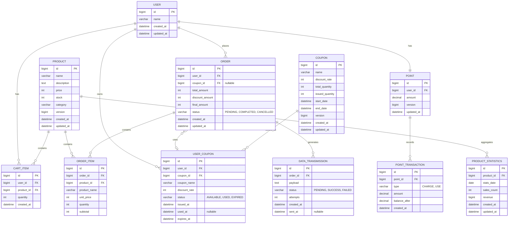

# e-commerce ERD (Entity Relationship Diagram)

## 🎯 DB 설계 원칙

### FK 제약조건 미사용
- **FK 제약조건을 사용하지 않음** (성능, 데드락 방지, 샤딩 대비)
- 애플리케이션 레벨에서 참조 무결성 관리
- **인덱스는 유지** (조회 성능을 위해 필요)

### 낙관적 락 사용
- PRODUCT, COUPON, POINT 테이블에 `version` 컬럼 추가
- DB 락 대신 version 컬럼으로 동시성 제어
- UPDATE 실패 시 애플리케이션에서 재시도

### 비정규화 전략
- ORDER_ITEM, USER_COUPON: 스냅샷 데이터 저장 (과거 데이터 일관성 유지)
- PRODUCT_STATISTICS: 통계 데이터 사전 집계 (쿼리 성능 최적화)

---

## 🗂️ ERD 다이어그램



---

## 📋 테이블 상세 명세

### 1. USER (사용자)

| 컬럼명 | 타입 | 제약조건 | 설명 |
|--------|------|----------|------|
| id | BIGINT | PK, AUTO_INCREMENT | 사용자 ID |
| name | VARCHAR(100) | NOT NULL | 사용자 이름 |
| created_at | DATETIME | NOT NULL | 생성 시간 |
| updated_at | DATETIME | NOT NULL | 수정 시간 |

**인덱스:**
- PRIMARY KEY (id)

---

### 2. POINT (잔액)

| 컬럼명 | 타입 | 제약조건 | 설명 |
|--------|------|----------|------|
| id | BIGINT | PK, AUTO_INCREMENT | 잔액 ID |
| user_id | BIGINT | FK, UNIQUE, NOT NULL | 사용자 ID |
| amount | DECIMAL(15,2) | NOT NULL, DEFAULT 0 | 잔액 |
| version | BIGINT | NOT NULL, DEFAULT 0 | 낙관적 락 버전 |
| updated_at | DATETIME | NOT NULL | 마지막 업데이트 시간 |

**제약조건:**
- amount >= 0 (음수 불가)

**인덱스:**
- PRIMARY KEY (id)
- UNIQUE INDEX (user_id)

---

### 3. BALANCE_TRANSACTION (잔액 거래 이력)

| 컬럼명 | 타입 | 제약조건 | 설명 |
|--------|------|----------|------|
| id | BIGINT | PK, AUTO_INCREMENT | 거래 ID |
| balance_id | BIGINT | FK, NOT NULL | 잔액 ID |
| type | VARCHAR(10) | NOT NULL | 거래 타입 (CHARGE, USE) |
| amount | DECIMAL(15,2) | NOT NULL | 거래 금액 |
| balance_after | DECIMAL(15,2) | NOT NULL | 거래 후 잔액 |
| created_at | DATETIME | NOT NULL | 거래 시간 |

**제약조건:**
- FOREIGN KEY (balance_id) REFERENCES BALANCE(id)

**인덱스:**
- PRIMARY KEY (id)
- INDEX (balance_id, created_at)

---

### 4. PRODUCT (상품)

| 컬럼명 | 타입 | 제약조건 | 설명 |
|--------|------|----------|------|
| id | BIGINT | PK, AUTO_INCREMENT | 상품 ID |
| name | VARCHAR(200) | NOT NULL | 상품명 |
| description | TEXT | NULL | 상품 설명 |
| price | INT | NOT NULL | 가격 (원 단위) |
| stock | INT | NOT NULL, DEFAULT 0 | 재고 수량 |
| category | VARCHAR(100) | NULL | 카테고리 |
| version | BIGINT | NOT NULL, DEFAULT 0 | 낙관적 락 버전 |
| created_at | DATETIME | NOT NULL | 생성 시간 |
| updated_at | DATETIME | NOT NULL | 수정 시간 |

**제약조건:**
- price >= 0
- stock >= 0

**인덱스:**
- PRIMARY KEY (id)
- INDEX (category)
- INDEX (created_at)

---

### 5. CART_ITEM (장바구니)

| 컬럼명 | 타입 | 제약조건 | 설명 |
|--------|------|----------|------|
| id | BIGINT | PK, AUTO_INCREMENT | 장바구니 항목 ID |
| user_id | BIGINT | FK, NOT NULL | 사용자 ID |
| product_id | BIGINT | FK, NOT NULL | 상품 ID |
| quantity | INT | NOT NULL | 수량 |
| created_at | DATETIME | NOT NULL | 생성 시간 |

**제약조건:**
- quantity > 0
- FOREIGN KEY (user_id) REFERENCES USER(id)
- FOREIGN KEY (product_id) REFERENCES PRODUCT(id)

**인덱스:**
- PRIMARY KEY (id)
- INDEX (user_id)
- UNIQUE INDEX (user_id, product_id)

---

### 6. ORDER (주문)

| 컬럼명 | 타입 | 제약조건 | 설명 |
|--------|------|----------|------|
| id | BIGINT | PK, AUTO_INCREMENT | 주문 ID |
| user_id | BIGINT | FK, NOT NULL | 사용자 ID |
| coupon_id | BIGINT | FK, NULL | 사용한 쿠폰 ID |
| total_amount | INT | NOT NULL | 총 금액 (원 단위) |
| discount_amount | INT | NOT NULL, DEFAULT 0 | 할인 금액 (원 단위) |
| final_amount | INT | NOT NULL | 최종 결제 금액 (원 단위) |
| status | VARCHAR(20) | NOT NULL | 주문 상태 (PENDING, COMPLETED, CANCELLED) |
| created_at | DATETIME | NOT NULL | 주문 생성 시간 |
| updated_at | DATETIME | NOT NULL | 수정 시간 |

**제약조건:**
- final_amount = total_amount - discount_amount
- FOREIGN KEY (user_id) REFERENCES USER(id)
- FOREIGN KEY (coupon_id) REFERENCES USER_COUPON(id)

**인덱스:**
- PRIMARY KEY (id)
- INDEX (user_id, status)
- INDEX (created_at)

---

### 7. ORDER_ITEM (주문 상품)

| 컬럼명 | 타입 | 제약조건 | 설명 |
|--------|------|----------|------|
| id | BIGINT | PK, AUTO_INCREMENT | 주문 항목 ID |
| order_id | BIGINT | FK, NOT NULL | 주문 ID |
| product_id | BIGINT | FK, NOT NULL | 상품 ID |
| product_name | VARCHAR(200) | NOT NULL | 상품명 (스냅샷) |
| unit_price | INT | NOT NULL | 단가 (원 단위, 스냅샷) |
| quantity | INT | NOT NULL | 수량 |
| subtotal | INT | NOT NULL | 소계 (원 단위) |

**제약조건:**
- subtotal = unit_price * quantity
- FOREIGN KEY (order_id) REFERENCES ORDER(id)
- FOREIGN KEY (product_id) REFERENCES PRODUCT(id)

**인덱스:**
- PRIMARY KEY (id)
- INDEX (order_id)
- INDEX (product_id)

**비정규화 이유:**
- product_name, unit_price를 스냅샷으로 저장
- 상품 정보 변경 시에도 과거 주문 데이터 일관성 유지

---

### 8. COUPON (쿠폰)

| 컬럼명 | 타입 | 제약조건 | 설명 |
|--------|------|----------|------|
| id | BIGINT | PK, AUTO_INCREMENT | 쿠폰 ID |
| name | VARCHAR(100) | NOT NULL | 쿠폰명 |
| discount_rate | INT | NOT NULL | 할인율 (%) |
| total_quantity | INT | NOT NULL | 총 발급 가능 수량 |
| issued_quantity | INT | NOT NULL, DEFAULT 0 | 현재 발급된 수량 |
| start_date | DATETIME | NOT NULL | 유효 시작일 |
| end_date | DATETIME | NOT NULL | 유효 종료일 |
| version | BIGINT | NOT NULL, DEFAULT 0 | 낙관적 락 버전 |
| created_at | DATETIME | NOT NULL | 생성 시간 |
| updated_at | DATETIME | NOT NULL | 수정 시간 |

**제약조건:**
- discount_rate BETWEEN 1 AND 100
- issued_quantity <= total_quantity
- end_date > start_date

**인덱스:**
- PRIMARY KEY (id)
- INDEX (start_date, end_date)

---

### 9. USER_COUPON (사용자 쿠폰)

| 컬럼명 | 타입 | 제약조건 | 설명 |
|--------|------|----------|------|
| id | BIGINT | PK, AUTO_INCREMENT | 사용자 쿠폰 ID |
| user_id | BIGINT | FK, NOT NULL | 사용자 ID |
| coupon_id | BIGINT | FK, NOT NULL | 쿠폰 ID |
| name | VARCHAR(100) | NOT NULL | 쿠폰명 |
| discount_rate | INT | NOT NULL | 할인율 (%) |
| status | VARCHAR(20) | NOT NULL | 상태 (AVAILABLE, USED, EXPIRED) |
| issued_at | DATETIME | NOT NULL | 발급 시간 |
| used_at | DATETIME | NULL | 사용 시간 |
| expires_at | DATETIME | NOT NULL | 만료 시간 |

**제약조건:**
- FOREIGN KEY (user_id) REFERENCES USER(id)
- FOREIGN KEY (coupon_id) REFERENCES COUPON(id)
- UNIQUE (user_id, coupon_id) - 1인 1매 제한

**인덱스:**
- PRIMARY KEY (id)
- INDEX (user_id, status)
- INDEX (coupon_id)
- INDEX (expires_at)
- UNIQUE INDEX (user_id, coupon_id)

---

### 10. DATA_TRANSMISSION (외부 데이터 전송)

| 컬럼명 | 타입 | 제약조건 | 설명 |
|--------|------|----------|------|
| id | BIGINT | PK, AUTO_INCREMENT | 전송 ID |
| order_id | BIGINT | FK, NOT NULL | 주문 ID |
| payload | TEXT | NOT NULL | 전송할 데이터 (JSON) |
| status | VARCHAR(20) | NOT NULL | 전송 상태 (PENDING, SUCCESS, FAILED) |
| attempts | INT | NOT NULL, DEFAULT 0 | 재시도 횟수 |
| created_at | DATETIME | NOT NULL | 생성 시간 |
| sent_at | DATETIME | NULL | 전송 완료 시간 |

**제약조건:**
- FOREIGN KEY (order_id) REFERENCES ORDER(id)
- attempts >= 0

**인덱스:**
- PRIMARY KEY (id)
- INDEX (order_id)
- INDEX (status, created_at)

**설명:**
- Outbox 패턴을 위한 테이블
- 외부 데이터 플랫폼 전송 실패 시 재시도 관리
- 최대 3회까지 재시도

---

### 11. PRODUCT_STATISTICS (상품 통계)

| 컬럼명 | 타입 | 제약조건 | 설명 |
|--------|------|----------|------|
| id | BIGINT | PK, AUTO_INCREMENT | 통계 ID |
| product_id | BIGINT | FK, NOT NULL | 상품 ID |
| stats_date | DATE | NOT NULL | 통계 기준 날짜 |
| sales_count | INT | NOT NULL, DEFAULT 0 | 판매 수량 (일별 합계) |
| revenue | BIGINT | NOT NULL, DEFAULT 0 | 매출액 (일별 합계, 원 단위) |
| created_at | DATETIME | NOT NULL | 생성 시간 |
| updated_at | DATETIME | NOT NULL | 수정 시간 |

**제약조건:**
- FOREIGN KEY (product_id) REFERENCES PRODUCT(id)
- UNIQUE (product_id, stats_date) - 상품별 날짜별 1개 레코드

**인덱스:**
- PRIMARY KEY (id)
- UNIQUE INDEX (product_id, stats_date)
- INDEX (stats_date, sales_count DESC) - 인기 상품 조회 최적화
- INDEX (stats_date, revenue DESC) - 매출 상위 상품 조회 최적화

**설명:**
- 상품별 일별 판매 통계 집계 테이블
- 매일 배치 작업으로 전날 주문 데이터 집계하여 저장
- 인기 상품 조회 쿼리 성능 최적화 목적

**성능 개선 효과:**
- BEFORE: orders + order_items 2개 테이블 조인 + 날짜 범위 필터링 + GROUP BY 집계
- AFTER: product_statistics 단일 테이블 조회 + 날짜 범위 필터링 (이미 집계된 데이터)
- 예상 성능 향상: 10~100배 (데이터 양에 따라 차이)

---

## 🔗 관계 설명

### 1:1 관계
- USER : BALANCE (사용자 1명당 잔액 1개)

### 1:N 관계
- USER : CART_ITEM (사용자가 여러 장바구니 항목을 가짐)
- USER : ORDER (사용자가 여러 주문을 가짐)
- USER : USER_COUPON (사용자가 여러 쿠폰을 가짐)
- PRODUCT : CART_ITEM (상품이 여러 장바구니에 담김)
- PRODUCT : ORDER_ITEM (상품이 여러 주문에 포함됨)
- ORDER : ORDER_ITEM (주문이 여러 주문 항목을 가짐)
- COUPON : USER_COUPON (쿠폰이 여러 사용자에게 발급됨)
- BALANCE : BALANCE_TRANSACTION (잔액이 여러 거래 이력을 가짐)

### N:1 관계 (Optional)
- ORDER : USER_COUPON (주문이 쿠폰을 사용할 수 있음, nullable)

---

## 📊 데이터 정합성 규칙

### 재고 관리
```sql
-- 재고 차감 시 음수 방지
UPDATE products 
SET stock = stock - :quantity 
WHERE id = :productId 
  AND stock >= :quantity;
```

### 쿠폰 발급 수량 관리
```sql
-- 발급 수량 초과 방지
UPDATE coupons 
SET issued_quantity = issued_quantity + 1 
WHERE id = :couponId 
  AND issued_quantity < total_quantity;
```

### 잔액 차감
```sql
-- 잔액 부족 방지
UPDATE balances 
SET amount = amount - :amount 
WHERE user_id = :userId 
  AND amount >= :amount;
```

---

## 🎯 인기 상품 통계 쿼리

### BEFORE: 기존 쿼리 (비최적화)

```sql
-- 최근 3일간 판매량 기준 Top 5 (실시간 집계)
SELECT
    p.id,
    p.name,
    SUM(oi.quantity) as sales_count,
    SUM(oi.subtotal) as revenue
FROM products p
INNER JOIN order_items oi ON p.id = oi.product_id
INNER JOIN orders o ON oi.order_id = o.id
WHERE o.status = 'COMPLETED'
  AND o.created_at >= DATE_SUB(NOW(), INTERVAL 3 DAY)
GROUP BY p.id, p.name
ORDER BY sales_count DESC
LIMIT 5;
```

**문제점:**
- 매번 ORDER, ORDER_ITEM 테이블 조인 필요
- GROUP BY 집계 연산 필요
- 주문 데이터가 많을수록 성능 저하

### AFTER: 최적화된 쿼리 (통계 테이블 사용 + 조인 제거)

```sql
-- 최근 3일간 판매량 기준 Top 5 (조인 없는 집계 쿼리)
SELECT
    product_id,
    SUM(sales_count) as total_sales,
    SUM(revenue) as total_revenue
FROM product_statistics
WHERE stats_date >= DATE_SUB(CURDATE(), INTERVAL 3 DAY)
GROUP BY product_id
ORDER BY total_sales DESC
LIMIT 5;
```

**개선사항:**
- 조인 완전 제거 (단일 테이블만 조회)
- 이미 집계된 일별 데이터 사용
- INDEX (stats_date, sales_count DESC) 활용 가능
- 예상 성능 향상: 10~100배

**상품명 조회:**
- 애플리케이션에서 product_id로 별도 조회
- 또는 통계 테이블에 product_name 컬럼 추가 (비정규화 옵션)

---

## 📝 설계 참고사항

### 비정규화
- **ORDER_ITEM**: 상품명, 단가를 스냅샷으로 저장
    - 이유: 과거 주문 데이터 일관성 유지

### 제외 테이블
- 주문 이력 (order_history)
- 재고 변동 이력 (stock_history)
- 환불 (refund)
- 결제 이력 (payment_history)
- 상품 옵션 (product_option)

---

## 🔒 동시성 제어 포인트

### 낙관적 락 (Optimistic Lock) 적용

동시성 이슈가 발생할 수 있는 테이블에 `version` 컬럼을 추가하여 낙관적 락을 구현합니다.

#### 적용 대상 테이블
1. **PRODUCT**: 재고 차감 시 동시성 제어
2. **COUPON**: 쿠폰 발급 수량 증가 시 동시성 제어
3. **POINT**: 포인트 잔액 업데이트 시 동시성 제어

#### 낙관적 락 패턴

```sql
-- PRODUCT 재고 차감 예시
UPDATE products
SET stock = stock - :quantity,
    version = version + 1,
    updated_at = NOW()
WHERE id = :productId
  AND version = :currentVersion
  AND stock >= :quantity;

-- COUPON 발급 수량 증가 예시
UPDATE coupons
SET issued_quantity = issued_quantity + 1,
    version = version + 1,
    updated_at = NOW()
WHERE id = :couponId
  AND version = :currentVersion
  AND issued_quantity < total_quantity;

-- POINT 잔액 차감 예시
UPDATE points
SET amount = amount - :amount,
    version = version + 1,
    updated_at = NOW()
WHERE id = :pointId
  AND version = :currentVersion
  AND amount >= :amount;
```

#### 낙관적 락 동작 방식
1. 데이터 조회 시 현재 version 값을 함께 조회
2. 업데이트 시 WHERE 절에 version 조건 추가
3. version이 일치하지 않으면 UPDATE 실패 (affected rows = 0)
4. 실패 시 애플리케이션에서 재시도 또는 예외 처리

#### 장점
- DB 락을 사용하지 않아 성능 저하 최소화
- 읽기 작업이 많은 환경에서 효율적
- 데드락 발생 가능성 없음

#### 주의사항
- UPDATE 실패 시 애플리케이션 레벨에서 재시도 로직 필요
- 충돌 빈도가 높은 경우 재시도 오버헤드 발생 가능

