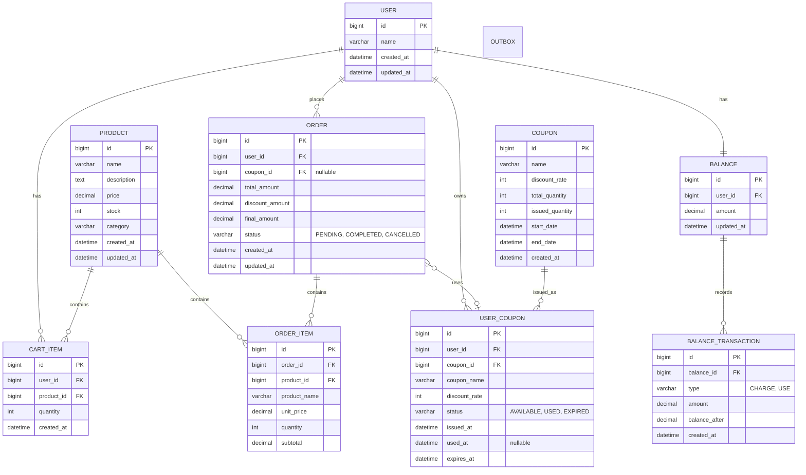

# e-commerce ERD (Entity Relationship Diagram)

## 🗂️ ERD 다이어그램



---

## 📋 테이블 상세 명세

### 1. USER (사용자)

| 컬럼명 | 타입 | 제약조건 | 설명 |
|--------|------|----------|------|
| id | BIGINT | PK, AUTO_INCREMENT | 사용자 ID |
| name | VARCHAR(100) | NOT NULL | 사용자 이름 |
| created_at | DATETIME | NOT NULL | 생성 시간 |
| updated_at | DATETIME | NOT NULL | 수정 시간 |

**인덱스:**
- PRIMARY KEY (id)

---

### 2. BALANCE (잔액)

| 컬럼명 | 타입 | 제약조건 | 설명 |
|--------|------|----------|------|
| id | BIGINT | PK, AUTO_INCREMENT | 잔액 ID |
| user_id | BIGINT | FK, UNIQUE, NOT NULL | 사용자 ID |
| amount | DECIMAL(15,2) | NOT NULL, DEFAULT 0 | 잔액 |
| updated_at | DATETIME | NOT NULL | 마지막 업데이트 시간 |

**제약조건:**
- amount >= 0 (음수 불가)
- FOREIGN KEY (user_id) REFERENCES USER(id)

**인덱스:**
- PRIMARY KEY (id)
- UNIQUE INDEX (user_id)

---

### 3. BALANCE_TRANSACTION (잔액 거래 이력)

| 컬럼명 | 타입 | 제약조건 | 설명 |
|--------|------|----------|------|
| id | BIGINT | PK, AUTO_INCREMENT | 거래 ID |
| balance_id | BIGINT | FK, NOT NULL | 잔액 ID |
| type | VARCHAR(10) | NOT NULL | 거래 타입 (CHARGE, USE) |
| amount | DECIMAL(15,2) | NOT NULL | 거래 금액 |
| balance_after | DECIMAL(15,2) | NOT NULL | 거래 후 잔액 |
| created_at | DATETIME | NOT NULL | 거래 시간 |

**제약조건:**
- FOREIGN KEY (balance_id) REFERENCES BALANCE(id)

**인덱스:**
- PRIMARY KEY (id)
- INDEX (balance_id, created_at)

---

### 4. PRODUCT (상품)

| 컬럼명 | 타입 | 제약조건 | 설명 |
|--------|------|----------|------|
| id | BIGINT | PK, AUTO_INCREMENT | 상품 ID |
| name | VARCHAR(200) | NOT NULL | 상품명 |
| description | TEXT | NULL | 상품 설명 |
| price | DECIMAL(15,2) | NOT NULL | 가격 |
| stock | INT | NOT NULL, DEFAULT 0 | 재고 수량 |
| category | VARCHAR(100) | NULL | 카테고리 |
| created_at | DATETIME | NOT NULL | 생성 시간 |
| updated_at | DATETIME | NOT NULL | 수정 시간 |

**제약조건:**
- price >= 0
- stock >= 0

**인덱스:**
- PRIMARY KEY (id)
- INDEX (category)
- INDEX (created_at)

---

### 5. CART_ITEM (장바구니)

| 컬럼명 | 타입 | 제약조건 | 설명 |
|--------|------|----------|------|
| id | BIGINT | PK, AUTO_INCREMENT | 장바구니 항목 ID |
| user_id | BIGINT | FK, NOT NULL | 사용자 ID |
| product_id | BIGINT | FK, NOT NULL | 상품 ID |
| quantity | INT | NOT NULL | 수량 |
| created_at | DATETIME | NOT NULL | 생성 시간 |

**제약조건:**
- quantity > 0
- FOREIGN KEY (user_id) REFERENCES USER(id)
- FOREIGN KEY (product_id) REFERENCES PRODUCT(id)

**인덱스:**
- PRIMARY KEY (id)
- INDEX (user_id)
- UNIQUE INDEX (user_id, product_id)

---

### 6. ORDER (주문)

| 컬럼명 | 타입 | 제약조건 | 설명 |
|--------|------|----------|------|
| id | BIGINT | PK, AUTO_INCREMENT | 주문 ID |
| user_id | BIGINT | FK, NOT NULL | 사용자 ID |
| coupon_id | BIGINT | FK, NULL | 사용한 쿠폰 ID |
| total_amount | DECIMAL(15,2) | NOT NULL | 총 금액 |
| discount_amount | DECIMAL(15,2) | NOT NULL, DEFAULT 0 | 할인 금액 |
| final_amount | DECIMAL(15,2) | NOT NULL | 최종 결제 금액 |
| status | VARCHAR(20) | NOT NULL | 주문 상태 (PENDING, COMPLETED, CANCELLED) |
| created_at | DATETIME | NOT NULL | 주문 생성 시간 |
| updated_at | DATETIME | NOT NULL | 수정 시간 |

**제약조건:**
- final_amount = total_amount - discount_amount
- FOREIGN KEY (user_id) REFERENCES USER(id)
- FOREIGN KEY (coupon_id) REFERENCES USER_COUPON(id)

**인덱스:**
- PRIMARY KEY (id)
- INDEX (user_id, status)
- INDEX (created_at)

---

### 7. ORDER_ITEM (주문 상품)

| 컬럼명 | 타입 | 제약조건 | 설명 |
|--------|------|----------|------|
| id | BIGINT | PK, AUTO_INCREMENT | 주문 항목 ID |
| order_id | BIGINT | FK, NOT NULL | 주문 ID |
| product_id | BIGINT | FK, NOT NULL | 상품 ID |
| product_name | VARCHAR(200) | NOT NULL | 상품명 (스냅샷) |
| unit_price | DECIMAL(15,2) | NOT NULL | 단가 (스냅샷) |
| quantity | INT | NOT NULL | 수량 |
| subtotal | DECIMAL(15,2) | NOT NULL | 소계 |

**제약조건:**
- subtotal = unit_price * quantity
- FOREIGN KEY (order_id) REFERENCES ORDER(id)
- FOREIGN KEY (product_id) REFERENCES PRODUCT(id)

**인덱스:**
- PRIMARY KEY (id)
- INDEX (order_id)
- INDEX (product_id)

**비정규화 이유:**
- product_name, unit_price를 스냅샷으로 저장
- 상품 정보 변경 시에도 과거 주문 데이터 일관성 유지

---

### 8. COUPON (쿠폰)

| 컬럼명 | 타입 | 제약조건 | 설명 |
|--------|------|----------|------|
| id | BIGINT | PK, AUTO_INCREMENT | 쿠폰 ID |
| name | VARCHAR(100) | NOT NULL | 쿠폰명 |
| discount_rate | INT | NOT NULL | 할인율 (%) |
| total_quantity | INT | NOT NULL | 총 발급 가능 수량 |
| issued_quantity | INT | NOT NULL, DEFAULT 0 | 현재 발급된 수량 |
| start_date | DATETIME | NOT NULL | 유효 시작일 |
| end_date | DATETIME | NOT NULL | 유효 종료일 |
| created_at | DATETIME | NOT NULL | 생성 시간 |

**제약조건:**
- discount_rate BETWEEN 1 AND 100
- issued_quantity <= total_quantity
- end_date > start_date

**인덱스:**
- PRIMARY KEY (id)
- INDEX (start_date, end_date)

---

### 9. USER_COUPON (사용자 쿠폰)

| 컬럼명 | 타입 | 제약조건 | 설명 |
|--------|------|----------|------|
| id | BIGINT | PK, AUTO_INCREMENT | 사용자 쿠폰 ID |
| user_id | BIGINT | FK, NOT NULL | 사용자 ID |
| coupon_id | BIGINT | FK, NOT NULL | 쿠폰 ID |
| name | VARCHAR(100) | NOT NULL | 쿠폰명 |
| discount_rate | INT | NOT NULL | 할인율 (%) |
| status | VARCHAR(20) | NOT NULL | 상태 (AVAILABLE, USED, EXPIRED) |
| issued_at | DATETIME | NOT NULL | 발급 시간 |
| used_at | DATETIME | NULL | 사용 시간 |
| expires_at | DATETIME | NOT NULL | 만료 시간 |

**제약조건:**
- FOREIGN KEY (user_id) REFERENCES USER(id)
- FOREIGN KEY (coupon_id) REFERENCES COUPON(id)
- UNIQUE (user_id, coupon_id) - 1인 1매 제한

**인덱스:**
- PRIMARY KEY (id)
- INDEX (user_id, status)
- INDEX (coupon_id)
- INDEX (expires_at)
- UNIQUE INDEX (user_id, coupon_id)

---

## 🔗 관계 설명

### 1:1 관계
- USER : BALANCE (사용자 1명당 잔액 1개)

### 1:N 관계
- USER : CART_ITEM (사용자가 여러 장바구니 항목을 가짐)
- USER : ORDER (사용자가 여러 주문을 가짐)
- USER : USER_COUPON (사용자가 여러 쿠폰을 가짐)
- PRODUCT : CART_ITEM (상품이 여러 장바구니에 담김)
- PRODUCT : ORDER_ITEM (상품이 여러 주문에 포함됨)
- ORDER : ORDER_ITEM (주문이 여러 주문 항목을 가짐)
- COUPON : USER_COUPON (쿠폰이 여러 사용자에게 발급됨)
- BALANCE : BALANCE_TRANSACTION (잔액이 여러 거래 이력을 가짐)

### N:1 관계 (Optional)
- ORDER : USER_COUPON (주문이 쿠폰을 사용할 수 있음, nullable)

---

## 📊 데이터 정합성 규칙

### 재고 관리
```sql
-- 재고 차감 시 음수 방지
UPDATE products 
SET stock = stock - :quantity 
WHERE id = :productId 
  AND stock >= :quantity;
```

### 쿠폰 발급 수량 관리
```sql
-- 발급 수량 초과 방지
UPDATE coupons 
SET issued_quantity = issued_quantity + 1 
WHERE id = :couponId 
  AND issued_quantity < total_quantity;
```

### 잔액 차감
```sql
-- 잔액 부족 방지
UPDATE balances 
SET amount = amount - :amount 
WHERE user_id = :userId 
  AND amount >= :amount;
```

---

## 🎯 인기 상품 통계 쿼리

```sql
-- 최근 3일간 판매량 기준 Top 5
SELECT 
    p.id,
    p.name,
    SUM(oi.quantity) as sales_count,
    SUM(oi.subtotal) as revenue
FROM products p
INNER JOIN order_items oi ON p.id = oi.product_id
INNER JOIN orders o ON oi.order_id = o.id
WHERE o.status = 'COMPLETED'
  AND o.created_at >= DATE_SUB(NOW(), INTERVAL 3 DAY)
GROUP BY p.id, p.name
ORDER BY sales_count DESC
LIMIT 5;
```

---

## 📝 설계 참고사항

### 비정규화
- **ORDER_ITEM**: 상품명, 단가를 스냅샷으로 저장
    - 이유: 과거 주문 데이터 일관성 유지

### 제외 테이블
- 주문 이력 (order_history)
- 재고 변동 이력 (stock_history)
- 환불 (refund)
- 결제 이력 (payment_history)
- 상품 옵션 (product_option)

---

## 🔒 동시성 제어 포인트

> **Note**: 실제 락 구현은 추후 적용 예정

### 향후 적용 필요
1. **재고 차감**: products.stock 업데이트 시
2. **쿠폰 발급**: coupons.issued_quantity 업데이트 시
3. **잔액 차감**: balances.amount 업데이트 시

