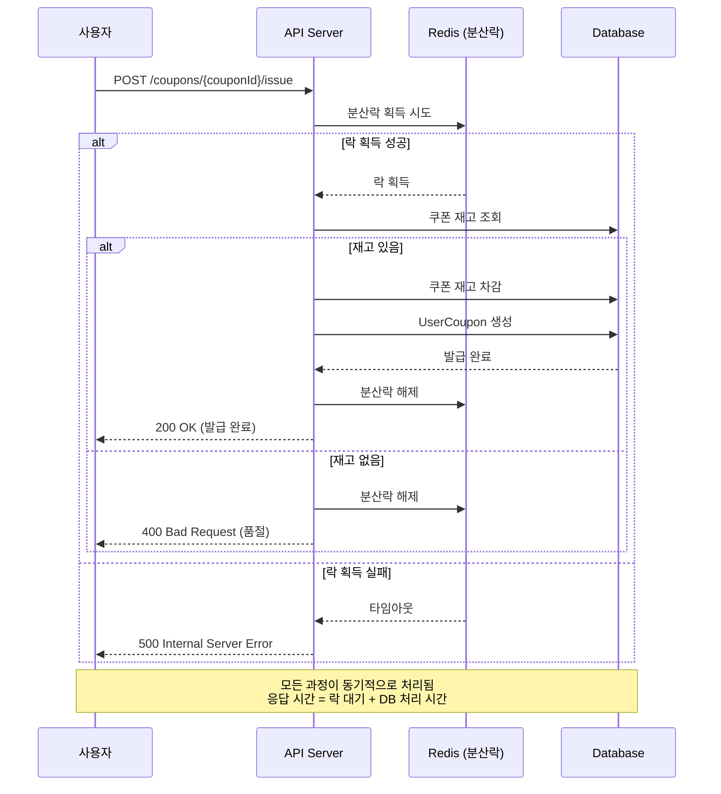
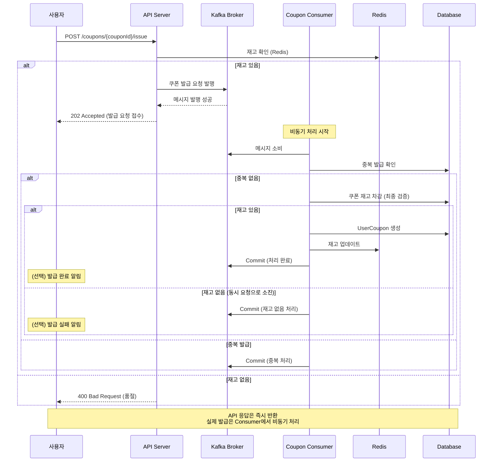

# 쿠폰 발급 프로세스 Kafka 적용 설계

## 1. 배경 및 목적

### 1.1 현재 문제점

**선착순 쿠폰 발급 시나리오:**
- 대량의 동시 트래픽이 DB에 집중
- 분산락을 사용한 동기 처리로 인한 응답 시간 증가
- 재고 차감 경합으로 인한 성능 저하
- 사용자 대기 시간 증가로 인한 UX 저하

### 1.2 개선 목표

**Kafka 적용을 통한 개선:**
- 비동기 처리로 즉시 응답 (발급 요청 접수)
- DB 부하 분산 (Consumer에서 순차 처리)
- 메시지 큐를 통한 순서 보장 및 공정성 확보
- 대량 트래픽에 대한 안정적인 처리
- 장애 격리 및 복구 가능성 향상

---

## 2. 현재 구조 (Before)

### 2.1 쿠폰 발급 프로세스

```
[사용자] → [API] → [CouponService] → [분산락 획득] → [DB 트랜잭션]
                                           ↓
                                    [재고 확인 및 차감]
                                           ↓
                                    [UserCoupon 생성]
                                           ↓
                                    [분산락 해제]
                                           ↓
                                    [응답 반환]
```

### 2.2 문제점 상세

**1. 동기 처리의 한계**
```java
public UserCoupon issueCouponWithDistributedLock(Long userId, Long couponId) {
    String lockKey = RedisLockKey.couponIssue(couponId);
    return lockManager.executeWithLock(lockKey, 5L, 10L, () ->
            couponTransactionService.issueCouponTransaction(userId, couponId)
    );
}
```
- 락 대기 시간 + 트랜잭션 처리 시간 = 긴 응답 시간
- 동시 요청 수만큼 락 경합 발생

**2. DB 부하 집중**
- 선착순 쿠폰 발급 시 순간적으로 수천~수만 건의 요청이 DB로 집중
- Connection Pool 고갈 가능성
- 다른 서비스에 영향

**3. 확장성 제약**
- 수평 확장 시에도 분산락으로 인한 병목
- 트래픽 증가에 따른 선형적 성능 개선 어려움

### 2.3 시퀀스 다이어그램 (Before)



---

## 3. 개선된 구조 (After)

### 3.1 Kafka 적용 프로세스

```
[사용자] → [API] → [Kafka Producer] → [Kafka Broker]
                         ↓                    ↓
                   즉시 응답 반환        [메시지 저장]
                                              ↓
                                    [Kafka Consumer]
                                              ↓
                                    [쿠폰 발급 처리]
                                              ↓
                                         [DB 저장]
```

### 3.2 개선 효과

**1. 비동기 처리**
- API는 Kafka에 메시지 발행 후 즉시 응답 (< 100ms)
- Consumer가 백그라운드에서 순차 처리
- 사용자 체감 응답 시간 대폭 감소

**2. DB 부하 분산**
- 요청이 Kafka 큐에 쌓임
- Consumer가 처리 가능한 속도로 순차 처리
- DB 부하 평준화

**3. 순서 보장 및 공정성**
- Kafka 파티션의 순서 보장 특성 활용
- 먼저 요청한 사용자가 먼저 처리됨
- 공정한 선착순 보장

**4. 장애 격리**
- Consumer 장애 시 API는 영향 없음
- 메시지는 Kafka에 안전하게 보관
- Consumer 복구 후 자동 재처리

**5. 확장성**
- Consumer 수평 확장 가능 (파티션 수만큼)
- 트래픽 증가 시 Consumer만 추가하면 됨

### 3.3 시퀀스 다이어그램 (After)



---

## 4. 카프카 토픽 설계

### 4.1 토픽 구성

#### **coupon-issue-request** (쿠폰 발급 요청)
- **목적:** 쿠폰 발급 요청 메시지 저장
- **파티션 수:** 6개
- **파티셔닝 키:** `couponId` (같은 쿠폰 발급 요청은 순서 보장)
- **Replication Factor:** 1 (로컬 개발), 3 (프로덕션)
- **Retention:** 7일

#### **coupon-issued** (쿠폰 발급 완료) - 선택 사항
- **목적:** 발급 완료 알림용 (추후 확장)
- **파티션 수:** 3개
- **파티셔닝 키:** `userId`

#### **coupon-issue-dlt** (Dead Letter Topic)
- **목적:** 처리 실패 메시지 저장 (재시도 3회 초과)
- **파티션 수:** 1개
- **Retention:** 30일

### 4.2 Consumer Group

- **Group ID:** `coupon-issue-service`
- **Concurrency:** 파티션 수만큼 (최대 6개)
- **Commit 방식:** 수동 커밋 (처리 완료 후)

---

## 5. 메시지 구조

### 5.1 CouponIssueRequestMessage

```java
public class CouponIssueRequestMessage {
    private String requestId;        // 멱등성 키 (UUID)
    private Long userId;             // 사용자 ID
    private Long couponId;           // 쿠폰 ID
    private LocalDateTime requestedAt; // 요청 시간
}
```

**메시지 예시:**
```json
{
  "requestId": "550e8400-e29b-41d4-a716-446655440000",
  "userId": 1,
  "couponId": 100,
  "requestedAt": "2025-12-19T10:30:00"
}
```

### 5.2 CouponIssuedMessage (선택)

```java
public class CouponIssuedMessage {
    private String requestId;
    private Long userId;
    private Long couponId;
    private Long userCouponId;
    private String status;           // SUCCESS, FAILED, SOLD_OUT
    private LocalDateTime issuedAt;
}
```

---

## 6. 멱등성 및 중복 처리

### 6.1 문제 상황

- 네트워크 재시도로 인한 중복 메시지
- Consumer 재시작 시 같은 메시지 재처리
- 동일 사용자의 중복 발급 요청

### 6.2 해결 방안

#### **1단계: Redis 캐시 확인 (빠른 중복 체크)**
```
Key: coupon:issued:{couponId}:{userId}
TTL: 1시간
```
- Consumer가 메시지 수신 시 Redis 먼저 확인
- 이미 발급되었다면 즉시 Commit하고 스킵

#### **2단계: DB 유니크 제약 조건**
```sql
ALTER TABLE user_coupons
ADD UNIQUE INDEX uk_user_coupon (user_id, coupon_id);
```
- Redis 캐시 미스 시에도 DB에서 최종 검증
- Unique 제약 위반 시 중복 처리

#### **3단계: requestId 기록**
```sql
CREATE TABLE coupon_issue_history (
    request_id VARCHAR(36) PRIMARY KEY,
    user_id BIGINT NOT NULL,
    coupon_id BIGINT NOT NULL,
    status VARCHAR(20) NOT NULL,
    created_at DATETIME NOT NULL
);
```
- 처리된 requestId를 기록
- 동일 requestId 재처리 방지

---

## 7. 장애 처리 및 복구

### 7.1 Consumer 장애

**시나리오:** Consumer 서버 다운

**처리:**
1. Kafka는 메시지를 계속 보관
2. Consumer 재시작 시 마지막 Commit Offset부터 재처리
3. 멱등성 보장으로 중복 발급 방지

### 7.2 DB 장애

**시나리오:** Database 일시적 장애

**처리:**
1. Consumer는 메시지 커밋하지 않음
2. Kafka가 메시지 재전송
3. DB 복구 후 자동으로 재처리
4. 최대 재시도 횟수(3회) 초과 시 DLT로 전송

### 7.3 재고 부족

**시나리오:** Redis는 재고 있었지만, DB에서 최종 검증 시 재고 없음

**처리:**
```java
try {
    // DB에서 재고 차감 시도
    coupon.increaseIssuedQuantity();
    couponRepository.save(coupon);
} catch (CouponSoldOutException e) {
    // 재고 없음 로그 기록
    log.warn("Coupon sold out - RequestId: {}, UserId: {}, CouponId: {}",
             requestId, userId, couponId);
    // Commit하고 다음 메시지 처리
    acknowledgment.acknowledge();
}
```

### 7.4 DLT (Dead Letter Topic)

**전송 조건:**
- 재시도 3회 초과
- 알 수 없는 예외 발생
- 데이터 무결성 오류

**처리:**
- 별도의 DLT Consumer에서 모니터링
- 관리자 알림
- 수동 재처리 또는 보상 처리

---

## 8. 성능 비교 예측

### 8.1 응답 시간

| 구분 | Before (분산락) | After (Kafka) | 개선율 |
|------|----------------|---------------|--------|
| API 응답 | 200-500ms | 50-100ms | 75% 개선 |
| 실제 발급 | 200-500ms | 1-2초 (비동기) | N/A |
| 사용자 체감 | 느림 | 빠름 | 만족도 향상 |

### 8.2 처리량

| 구분 | Before (분산락) | After (Kafka) |
|------|----------------|---------------|
| 초당 처리 | 100-200 TPS | 1,000+ TPS |
| 동시 접속 | 제한적 | 높음 |
| DB 부하 | 순간 집중 | 평준화 |

### 8.3 안정성

| 항목 | Before | After |
|------|--------|-------|
| 장애 격리 | 낮음 (DB 장애 시 API 영향) | 높음 (독립적) |
| 복구 가능성 | 수동 개입 필요 | 자동 복구 |
| 메시지 손실 | 가능 (서버 다운 시) | 없음 (Kafka 보관) |

---

## 9. 모니터링 및 알림

### 9.1 주요 지표

**Kafka 지표:**
- Producer 성공/실패율
- Consumer Lag (처리 지연)
- 메시지 처리 시간
- DLT 메시지 수

**비즈니스 지표:**
- 쿠폰 발급 성공률
- 중복 발급 시도 횟수
- 재고 소진 시간

### 9.2 알림 조건

- Consumer Lag > 1000 (처리 지연)
- DLT 메시지 발생
- 발급 실패율 > 5%
- Consumer 다운

---

## 10. 단계별 구현 계획

### Phase 1: 기본 구현
- [x] 토픽 생성 (coupon-issue-request)
- [ ] CouponIssueRequestMessage 정의
- [ ] Kafka Producer 구현
- [ ] Kafka Consumer 구현
- [ ] API 변경 (동기 → 비동기)

### Phase 2: 안정성 강화
- [ ] 멱등성 처리 (Redis + DB)
- [ ] DLT 구현
- [ ] 재시도 로직
- [ ] 에러 핸들링

### Phase 3: 모니터링
- [ ] Kafka UI 설정
- [ ] Consumer Lag 모니터링
- [ ] 알림 설정

### Phase 4: 테스트
- [ ] 단일 발급 테스트
- [ ] 동시 다발 발급 테스트 (부하 테스트)
- [ ] 장애 복구 테스트
- [ ] 중복 발급 방지 테스트

---
