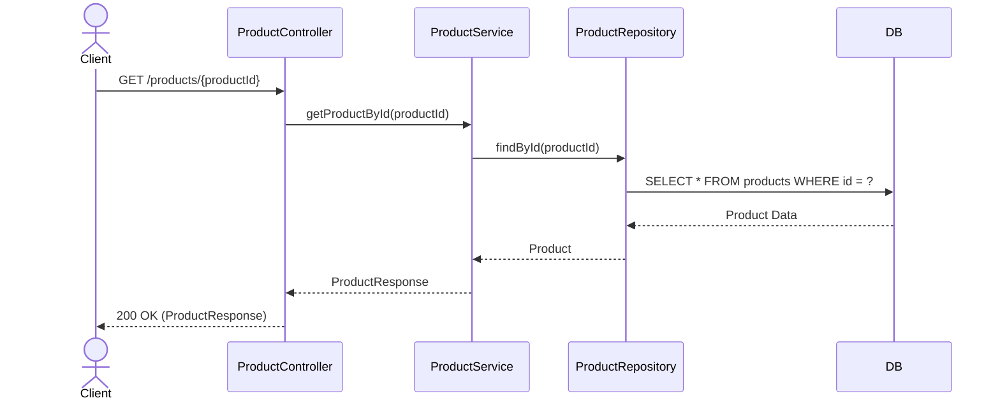
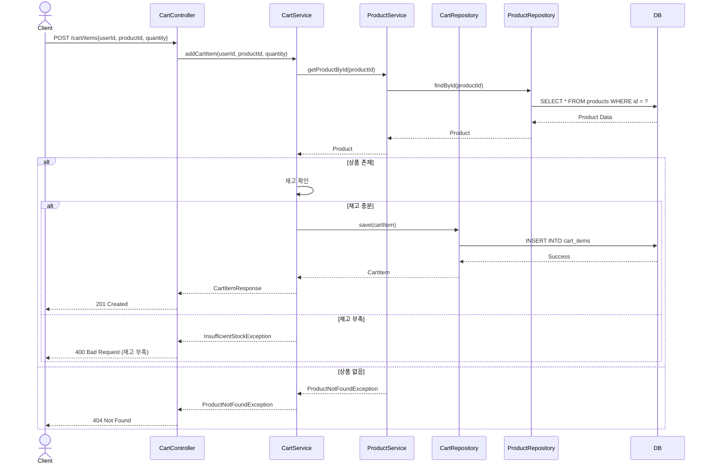
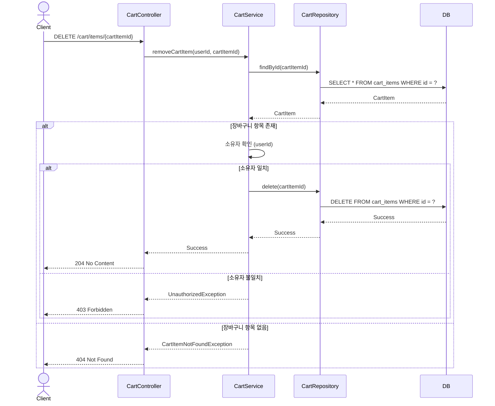
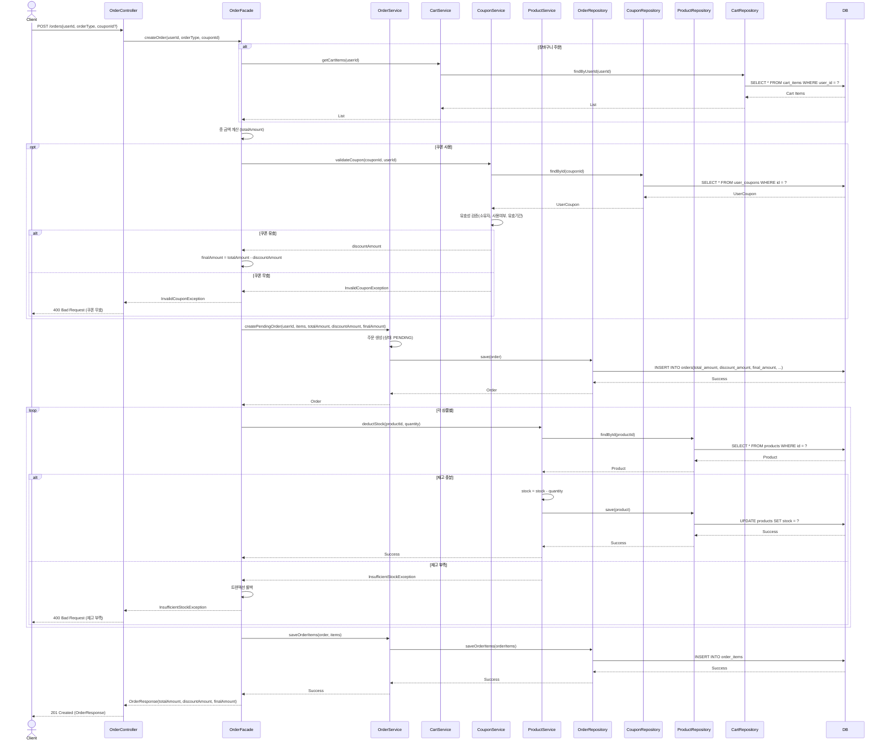
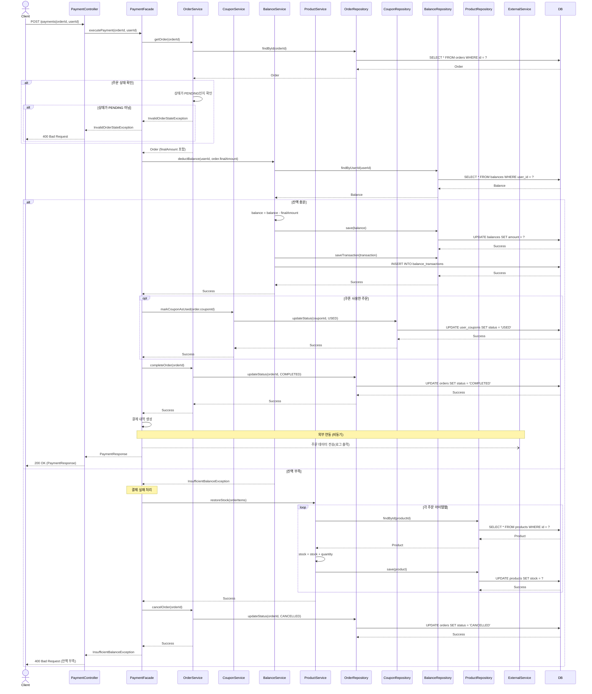
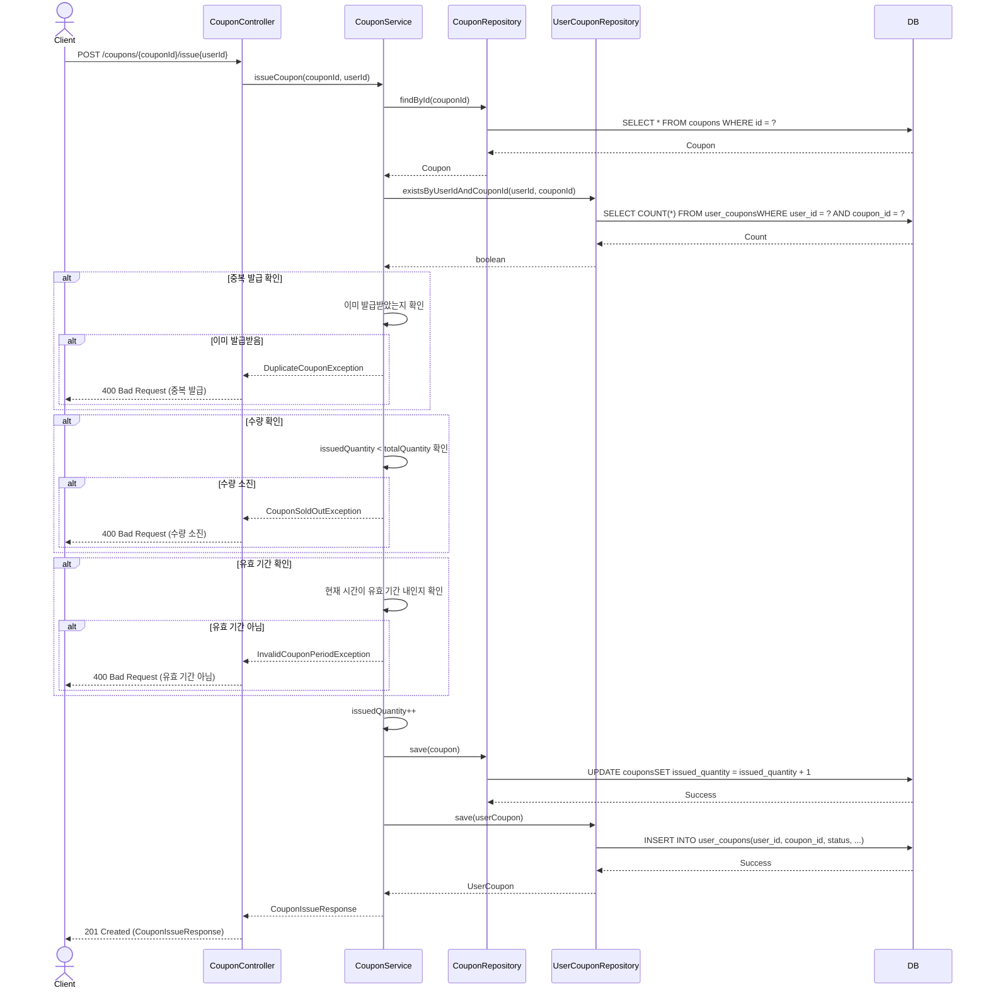
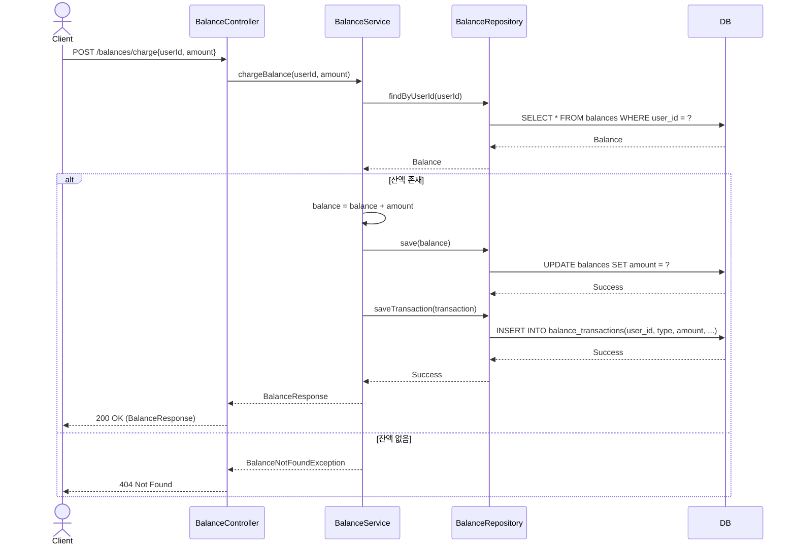
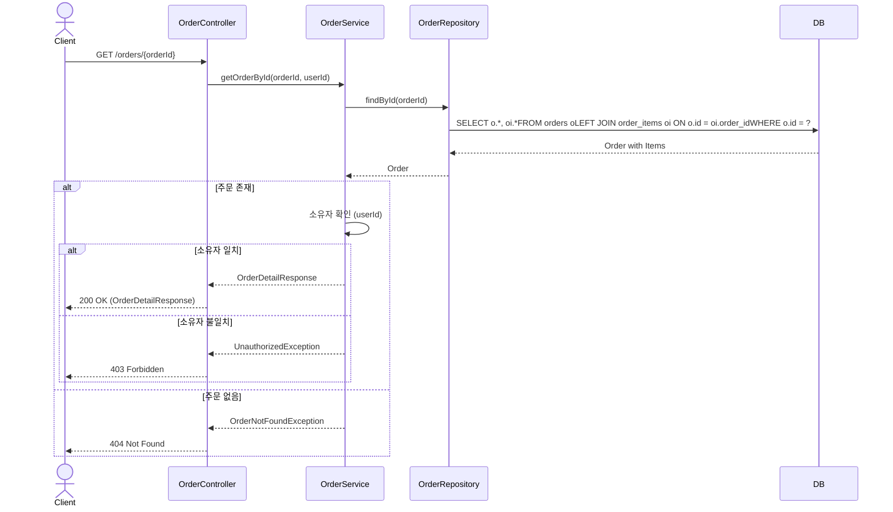

# e-commerce  시퀀스 다이어그램 (Sequence Diagrams)

---

## 1. 상품 상세 조회

### API
`GET /api/products/{productId}`

### 시퀀스 다이어그램

### 처리 흐름
1. 클라이언트가 상품 ID로 조회 요청
2. Controller가 Service에 조회 요청
3. Service가 Repository에 조회 요청
4. Repository가 DB에서 상품 정보 조회
5. 조회 결과를 DTO로 변환하여 응답

### 예외 처리
- 상품이 존재하지 않는 경우: `404 Not Found`

---

## 2. 장바구니 추가

### API
`POST /api/cart/items`

### 시퀀스 다이어그램

### 처리 흐름
1. 클라이언트가 장바구니 추가 요청
2. 상품 존재 여부 확인
3. 재고 수량 확인
4. 장바구니 아이템 생성 및 저장
5. 응답 반환

### 예외 처리
- 상품이 존재하지 않는 경우: `404 Not Found`
- 재고가 부족한 경우: `400 Bad Request`

---

## 3. 장바구니 삭제

### API
`DELETE /api/cart/items/{cartItemId}`

### 시퀀스 다이어그램

### 처리 흐름
1. 클라이언트가 장바구니 아이템 삭제 요청
2. 장바구니 아이템 조회
3. 소유자 확인
4. 삭제 처리
5. 응답 반환

### 예외 처리
- 장바구니 항목이 존재하지 않는 경우: `404 Not Found`
- 다른 사용자의 장바구니 항목: `403 Forbidden`

---

## 4. 주문 생성

### API
`POST /api/orders`

### 시퀀스 다이어그램

### 처리 흐름
1. 클라이언트가 주문 생성 요청 (쿠폰 선택 가능)
2. **OrderFacade**가 전체 흐름 조율
3. 장바구니 또는 즉시구매 상품 조회 (CartService)
4. 총 금액 계산
5. **쿠폰 유효성 검증 및 할인 금액 계산** (CouponService, 선택사항)
6. 최종 금액 계산 (총액 - 할인액)
7. 주문 생성 (OrderService, 상태: PENDING, 금액 정보 모두 저장)
8. 각 상품별로 재고 확인 및 차감 (ProductService)
9. 주문 아이템 저장 (OrderService)
10. 응답 반환 (총액, 할인액, 최종액)

### Facade 역할
- 여러 도메인 서비스(Cart, Coupon, Order, Product) 조율
- 트랜잭션 관리 (`@Transactional`)
- 비즈니스 플로우 제어

### 쿠폰 처리
- 주문 생성 시 쿠폰 유효성만 검증
- 할인 금액 계산 후 주문에 저장
- **실제 쿠폰 사용 처리는 결제 완료 시**

### 예외 처리
- 재고 부족: `400 Bad Request` + 트랜잭션 롤백
- 장바구니 비어있음: `400 Bad Request`
- 쿠폰 무효: `400 Bad Request`

> **Note**: 동시성 제어(재고 차감 시 락 처리)는 추후 적용 예정

---

## 5. 결제 실행

### API
`POST /api/payments`

### 시퀀스 다이어그램

### 처리 흐름
1. 클라이언트가 결제 요청
2. **PaymentFacade**가 전체 결제 플로우 조율
3. 주문 확인 (OrderService, PENDING 상태 검증)
4. **주문의 최종 금액(finalAmount)으로 결제**
5. 잔액 확인 및 차감 (BalanceService)
6. 쿠폰 사용 처리 (CouponService, 주문에 쿠폰이 있는 경우만)
7. 주문 상태 변경 (OrderService, COMPLETED)
8. 결제 내역 생성
9. 외부 시스템 전송 (로그로 대체, 비동기)

### Facade 역할
- 여러 도메인 서비스(Order, Coupon, Balance, Product) 조율
- 트랜잭션 관리 (`@Transactional`)
- 결제 성공/실패에 따른 복잡한 비즈니스 로직 처리
- 보상 트랜잭션(재고 복구) 관리

### 결제 실패 처리
- 잔액 부족 시:
    1. 주문 시 차감된 재고 복구 (ProductService)
    2. 주문 상태 변경 (OrderService, CANCELLED)
    3. 트랜잭션 롤백

### 쿠폰 처리
- **주문에 쿠폰 정보가 있으면** 결제 완료 시 사용 처리
- 쿠폰 상태를 USED로 변경

### 외부 연동
- 결제 완료 후 외부 시스템으로 주문 데이터 전송
- 실제 API 호출 대신 로그 출력으로 대체
- 외부 연동 실패해도 결제는 정상 완료
- 비동기 처리 (점선 화살표)

> **Note**: 동시성 제어(잔액 차감 시 락 처리)는 추후 적용 예정

---

---

## 6. 쿠폰 발급

### API
`POST /api/coupons/issue`

### 시퀀스 다이어그램

### 처리 흐름
1. 쿠폰 조회
2. 중복 발급 확인 (동일 사용자가 이미 발급받았는지)
3. 수량 확인 (issuedQuantity < totalQuantity)
4. 유효 기간 확인
5. 발급 수량 증가
6. 사용자에게 쿠폰 발급
7. 응답 반환

### 예외 처리
- 중복 발급: `400 Bad Request`
- 수량 소진: `400 Bad Request`
- 유효 기간 아님: `400 Bad Request`
- 쿠폰 없음: `404 Not Found`

> **Note**: 동시성 제어(쿠폰 수량 차감 시 락 처리)는 추후 적용 예정

---

## 7. 잔액 충전

### API
`POST /balances/charge`

### 시퀀스 다이어그램

### 처리 흐름
1. 사용자 잔액 조회
2. 충전 금액 추가
3. 잔액 업데이트
4. 거래 내역 저장 (타입: CHARGE)
5. 응답 반환

### 예외 처리
- 잔액 정보 없음: `404 Not Found`
- 충전 금액이 0 이하: `400 Bad Request`

---

## 8. 주문 조회

### API
`GET /orders/{orderId}`

### 시퀀스 다이어그램

### 처리 흐름
1. 주문 ID로 주문 조회 (주문 아이템 포함)
2. 소유자 확인
3. 주문 상세 정보 반환

### 예외 처리
- 주문 없음: `404 Not Found`
- 다른 사용자의 주문: `403 Forbidden`

---

## 📊 API 목록 요약

| 번호 | API | HTTP Method | 비고 |
|-----|-----|-------------|------|
| 1 | 상품 상세 조회 | GET | 기본 조회 |
| 2 | 장바구니 추가 | POST | 재고 확인 |
| 3 | 장바구니 삭제 | DELETE | 소유자 확인 |
| 4 | 주문 생성 | POST | Facade 패턴, 재고 차감 |
| 5 | 결제 실행 | POST | Facade 패턴, 쿠폰/잔액 차감 |
| 6 | 쿠폰 발급 | POST | 선착순, 수량 제어 |
| 7 | 잔액 충전 | POST | 잔액 증가 |
| 8 | 주문 조회 | GET | 주문 상세 |

**총 8개 API**

---

## 🔒 동시성 제어 포인트

> **Note**: 동시성 제어는 추후 학습 후 적용 예정입니다.

### 향후 적용할 동시성 제어
1. **재고 차감** (주문 생성 시)
    - 여러 사용자가 동시에 같은 상품 주문
    - 재고 정합성 보장 필요

2. **쿠폰 발급** (선착순)
    - 동시에 쿠폰 발급 요청
    - 설정 수량만큼만 발급 보장

3. **잔액 차감** (결제 시)
    - 동시에 여러 결제 요청
    - 잔액 정합성 보장 필요

